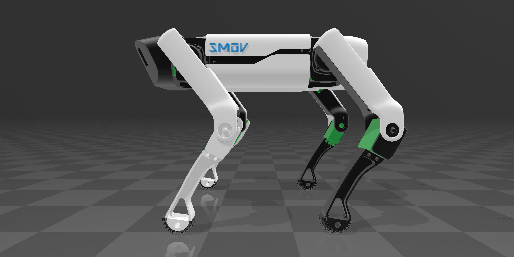
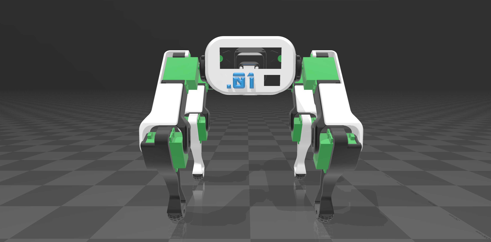
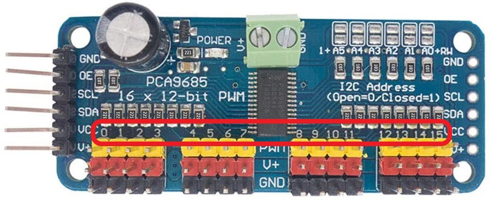
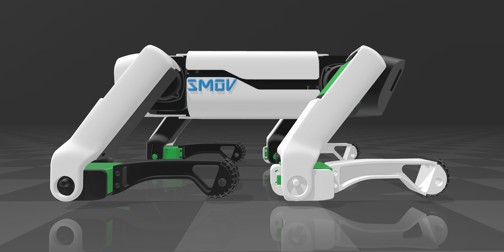
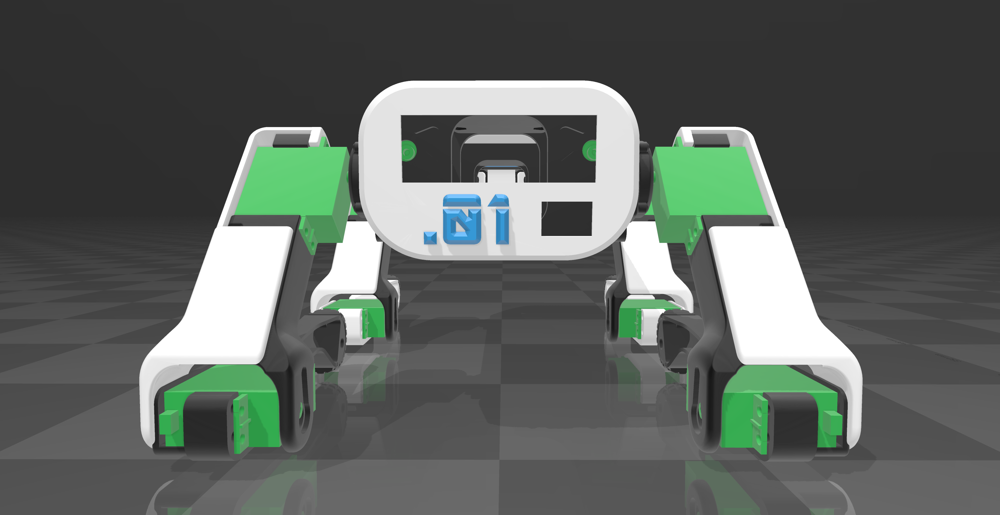
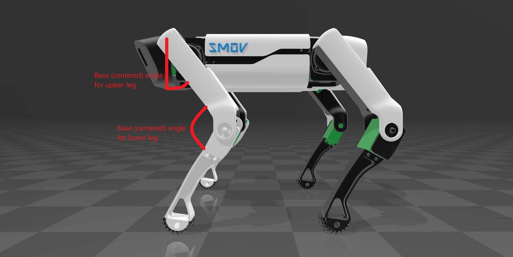
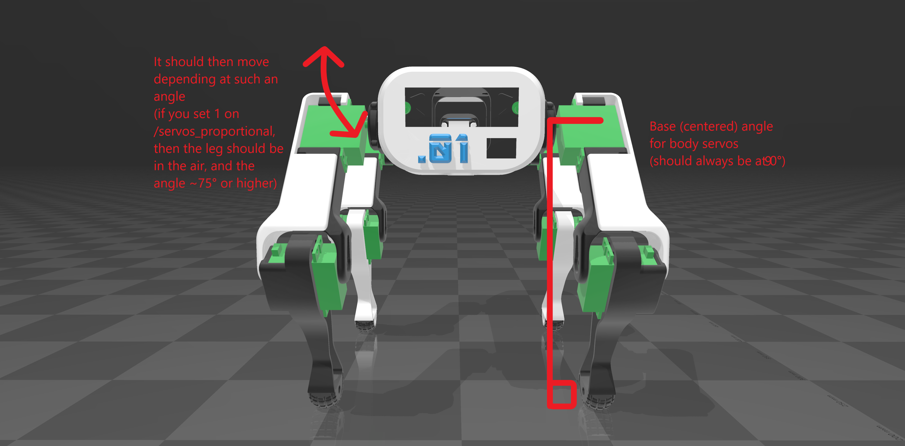
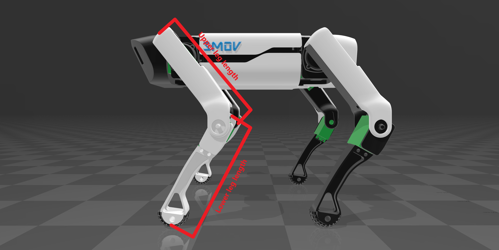
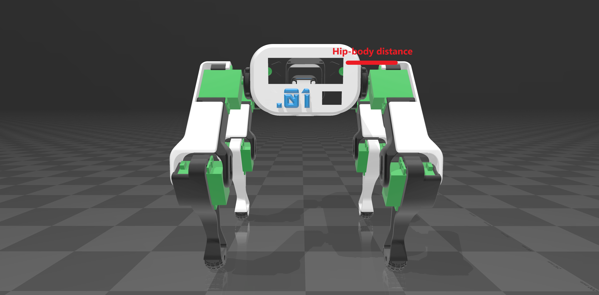

# Calibrate servos

Once you've built the project in the previous tutorial, you need to make sure you've built the `i2c_pwm_board` and `i2c_pwm_board_calibration` packages, which are essential for calibrating your servos quickly and efficiently.
First of all, you need to have two terminals open.

It is recommended to install servos in the Spot Micro / SMOV frame when they are powered and commanded to their center position. The joint which a servo is installed in should be approximately positioned at it's "neutral" stance, the position about which most leg motion will occur. This ensures maximum servo travel will be available around the typical joint command angles. The two figures below roughly depict the joint orientations for which servo's should be installed when at their center position. The following tutorial will show you how to find the center of your servos.





> **Note**: This position is designed to keep it stable on the ground when standing up.

## On the first terminal

Create `my_config.yaml` file in the `config/` directory.

```bash
cd config/
nano my_config.yaml
```

Take the `config/smov_single_board.yaml.example` example from the `config/` directory as your base (copy and paste this base into your `my_config.yaml` file).

```yaml
smov_setup_servos:  
  ros__parameters:
    # It is important to change the back servos ports if you're using a single board.
    use_single_board: true

    #                      Port, Center, Range,   Direction, Default value on Start (Proportional), Base (centered) angle, Max angle (The highest angle possible relative to the trigonometry package)
    FRONT_BODY_LEFT:       [0,   315,    220,     -1,        0,                                     90,                    130]
    FRONT_BODY_RIGHT:      [15,  315,    220,     1,         0,                                     90,                    130]

    FRONT_UPPER_LEG_LEFT:  [1,   315,    440,     1,         0,                                     55,                    170]
    FRONT_UPPER_LEG_RIGHT: [14,  300,    440,     -1,        0,                                     55,                    170]
    
    FRONT_LOWER_LEG_LEFT:  [2,   315,    440,     1,         -1,                                    110,                   190]
    FRONT_LOWER_LEG_RIGHT: [13,  340,    390,     -1,        -1,                                    110,                   190]

    BACK_BODY_LEFT:        [7,   315,    220,     1,         0,                                     90,                    130]
    BACK_BODY_RIGHT:       [8,   315,    220,     -1,        0,                                     90,                    130]

    BACK_UPPER_LEG_LEFT:   [6,   315,    440,     1,         0,                                     55,                    170]
    BACK_UPPER_LEG_RIGHT:  [9,   335,    440,     -1,        0,                                     55,                    170]
    
    BACK_LOWER_LEG_LEFT:   [5,   315,    400,     1,         -1,                                    110,                   190]
    BACK_LOWER_LEG_RIGHT:  [10,  315,    340,     -1,        -1,                                    110,                   190]

smov_states:  
  ros__parameters:
    # The values are in centimeters.
    upper_leg_length: 14.0
    lower_leg_length: 14.0
    hip_body_distance: 4.0
    
```

You can now quit your text editor.

Remember the port number of the servo you wish to manipulate.

Depending on which part of the robot the servo belongs to.



You can therefore modify the first column of each line by modifying the port according to the part of the robot that the servo represents.

Be sure to be inside the project directory, source the ROS2 packages, then run the `i2c_pwm_board` executable.

```bash
cd ~/smov
source install/setup.bash
ros2 run i2c_pwm_board controller 1 # 1: your desired bus (change it when using two boards or another bus).
```

If everything works, the program should tell you that it has been able to open `/i2c-n/` successfully (*n* being the number of your bus).

## On the second terminal

The rest of the tutorial consists of modifying your `my_config.yaml` file with the values for your servos. I won't go into too much detail later, but you need to test and modify each of the 12 servos that make up your robot using the following method.

Do you remember the port you designated for your servo? Depending on the servo you want to modify, you can choose the servo when the `i2c_pwm_board_calibration` program asks you to, knowing that `servo = port + 1`. So if you want to choose the servo at port 0, you will choose servo number 1.

To launch the `i2c_pwm_board_calibration` package, run the following command (while `i2c_pwm_board` is running on the other terminal):

```bash
cd ~/smov
source install/setup.bash
ros2 run i2c_pwm_board_calibration node
```

### Find the numerical values of the center and critical values

First of all, you choose the board you want to manipulate (the one your servos are stored on). If you are only using one microcontroller, specify board=1). Remember, main board (RPi default)=1, otherwise you can choose another number (to control the second board).
Then, you indicate the servo you want to manipulate using the method I indicated above. Finally, you choose your sensitivity.

After that, you can manipulate your arrows keys (up/down) to modify the value of your server, which will allow you to find its center and its critical values (which will therefore allow you to establish a range).

### Find the right direction for your servo

Finding the direction is very simple. If, when you set larger numerical values (with `i2c_pwm_board_calibration`), the robot leg holding towards the "servo rises up", you know that the direction is 1. Otherwise, you know that you need to set a -1 direction for the leg to rise with larger values.
Normally, the direction values are standard and should be either all inverted for your robot, or none inverted, in relation to `smov_single_board.yaml.example`, but even so, it depends on how you've set up your robot.

### The meaning of "Default value on Start (Proportional)"

The States package of the basic SMOV uses the `/servos_proportional` topic of the `i2c_pwm_board` to establish a simple system for the protected conversion of values ranging from -1 to 1 (I=[-1;1]) into numerical values. You can therefore choose a base value for your servo ranging from -1 to 1 when you start the States package. Remember that if you set the value to 1 then the servo will be at its highest possible maximum value, if you set the value to -1 it will be at its other extreme value opposite to 1, and if you set the value to 0 then the servo will be at the center point you defined earlier.

Personally, I've chosen to make the lowest servos on the robot have a value of 1, so that the robot can lie flat. Just like the two figures below:





> **Note**: This position is designed to keep it stable on the ground.

### Centered angle & Max angle

To modify the last two servo columns in your `my_config.yaml` file, you need to follow this model:




The maximum angle is simply the angle you have when you put 1 or -1 on your servo with the `/servos_proportional` topic, using the same angle measurement base (for example, with the upper leg length, you'd probably prefer to use the angle when you plug -1, whereas all the others, you will plug 1).

### Measures

You will have noticed that there are still three values to be adapted for your configuration file, these being:

```yaml
smov_states:  
  ros__parameters:
    # The values are in centimeters.
    upper_leg_length: 14.0
    lower_leg_length: 14.0
    hip_body_distance: 4.0
```

They are expressed in centimetres, as shown in the following figures:





That's it, your configuration file should be complete.

## Modifying launch files with your new configuration

All that's left is to modify the launch files so that you can launch the program with your configuration.

* In the case of a single microcontroller:

```py
from launch import LaunchDescription
from launch_ros.actions import Node

def generate_launch_description():
    return LaunchDescription([
        Node(
            package='i2c_pwm_board',
            executable='controller',
            arguments=['1'],
        ),
        Node(
            package='smov_setup_servos',
            executable='node',
            parameters=["config/my_config.yaml"] # From "smov_single_board.yaml.example" to "my_config.yaml".
        ),
        Node(
            package='smov_states',
            executable='manager',
            parameters=["config/my_config.yaml"], # From "smov_single_board.yaml.example" to "my_config.yaml".
            prefix="bash -c 'sleep 2.0; $0 $@'"
        ),
        Node(
            package='smov_monitor',
            executable='node',
        )
    ])
```

* In the case of two microcontrollers:

```py
from launch import LaunchDescription
from launch_ros.actions import Node

def generate_launch_description():
    return LaunchDescription([
        Node(
            package='i2c_pwm_board',
            executable='controller',
            arguments=['1'],
        ),
        Node(
            package='i2c_pwm_board',
            executable='controller',
            arguments=['4'], # Can be changed to 2, etc...
        ),
        Node(
            package='smov_setup_servos',
            executable='node',
            parameters=["config/my_config.yaml"] # From "smov_dual_board.yaml.example" to "my_config.yaml".
        ),
        Node(
            package='smov_states',
            executable='manager',
            parameters=["config/my_config.yaml"], # From "smov_dual_board.yaml.example" to "my_config.yaml".
            prefix="bash -c 'sleep 2.0; $0 $@'"
        ),
        Node(
            package='smov_monitor',
            executable='node',
        )
    ])
```

Your robot should now be configured to run the SMOV packages.

**Next step**: [Build a Spot Micro](build_a_spot_micro.md)
